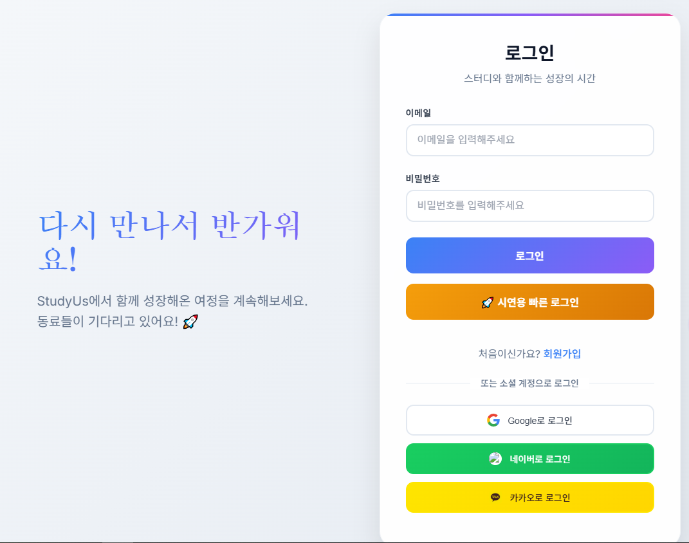
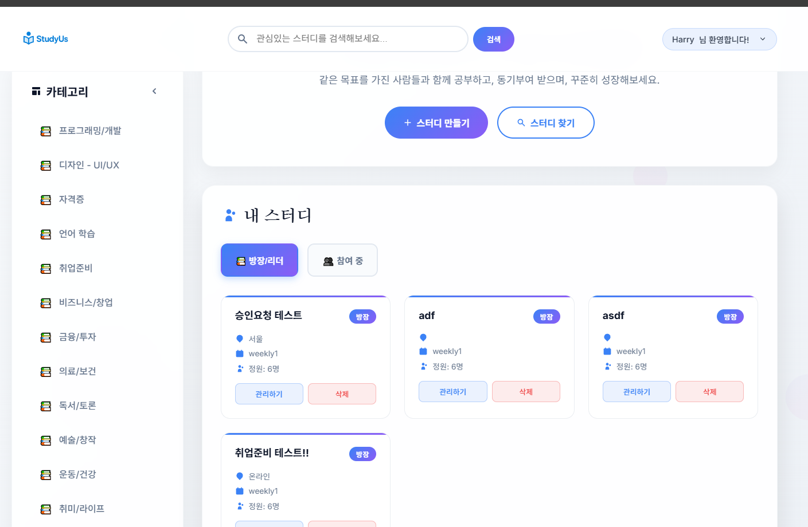
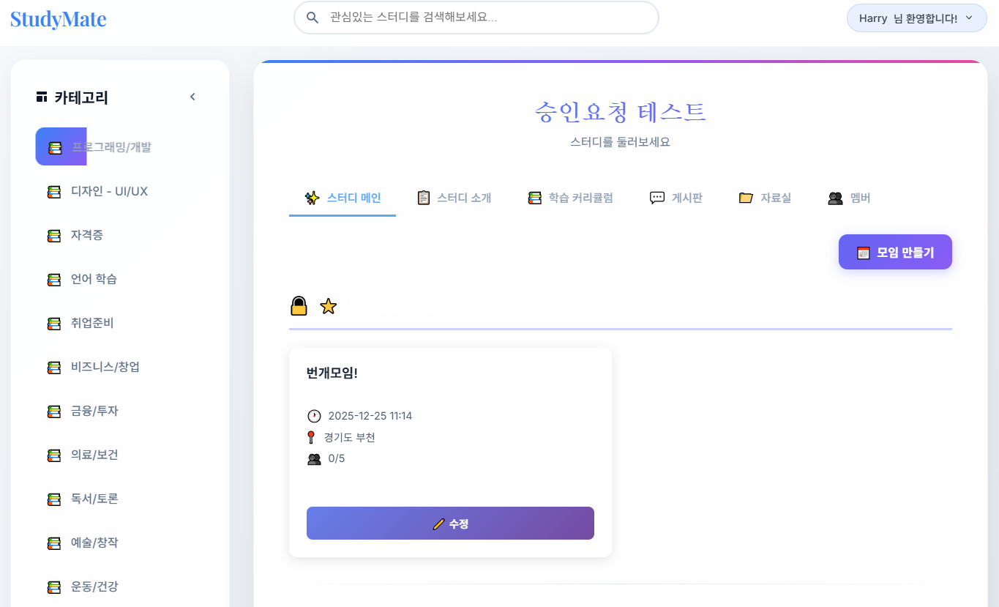
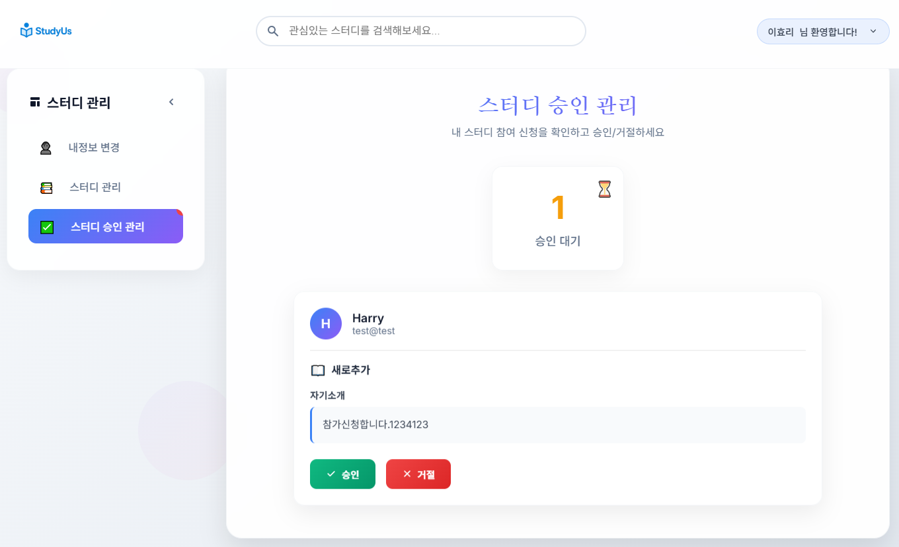
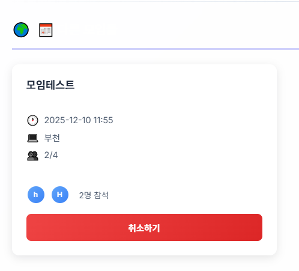
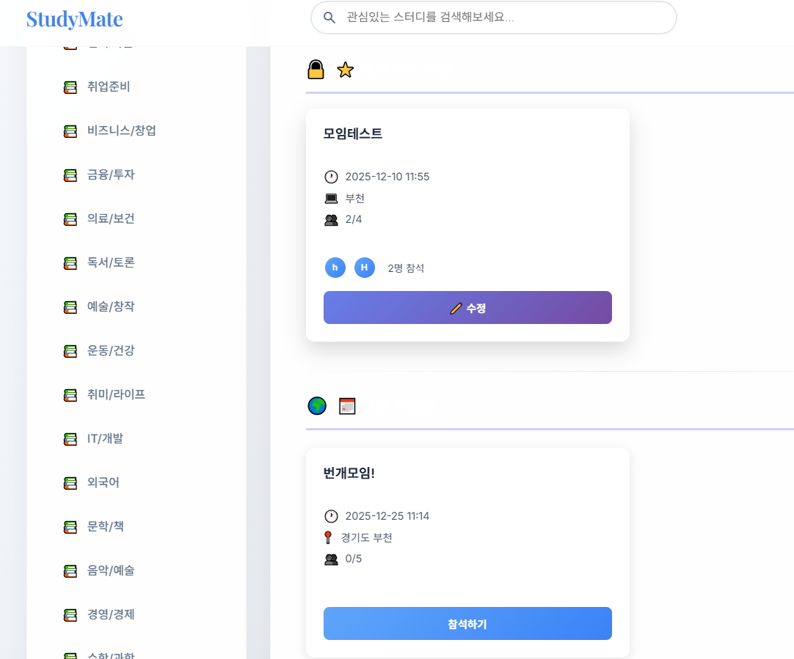

# 📚 StudyPort (스터디포트)

> **온/오프라인 스터디 모임을 위한 종합 관리 플랫폼**  
> 스터디 그룹 생성부터 멤버 관리, 정기 모임 일정 조율까지 한 곳에서!

<br>

## 📖 목차
1. [프로젝트 소개](#-프로젝트-소개)
2. [주요 기능](#-주요-기능)
3. [화면 구성](#-화면-구성)
4. [기술 스택](#️-기술-스택)
5. [프로젝트 구조](#-프로젝트-구조)
6. [핵심 구현 사항](#-핵심-구현-사항)
7. [트러블슈팅](#-트러블슈팅)
8. [개발 과정 및 느낀 점](#-개발-과정-및-느낀-점)

<br>

---

## ✨ 프로젝트 소개

### 📌 개요
- **프로젝트명**: StudyPort (스터디포트)
- **개발 기간**: 2024.12 ~ 2025.01 (약 2개월)
- **개발 인원**: 3명 (팀프로젝트) -> 1명 (개인 프로젝트)
- **프로젝트 목적**: 
  - 스터디 그룹의 체계적인 운영을 지원하는 웹 플랫폼 개발
  - Spring Boot & JPA를 활용한 실무 중심 백엔드 역량 강화
  - OAuth2 소셜 로그인, 권한 관리 등 실전 기능 구현 경험

### 🎯 기획 배경
온라인/오프라인 스터디 그룹이 증가하고 있지만, 멤버 관리와 정기 모임 일정 조율이 어려운 문제를 해결하고자 기획했습니다.
- 스터디 그룹 생성 및 참여 신청 자동화
- 정기 모임 일정 관리 및 참석 여부 확인 간소화
- 스터디장/운영진/일반 멤버 권한 구분을 통한 체계적 관리

<br>

---

## ✨ 주요 기능

### 👥 **1. 회원 관리**
- **일반 회원가입 / 로그인**: Spring Security 기반 인증
- **OAuth2 소셜 로그인**: Google, Kakao, Naver 계정 연동
- **회원 프로필 관리**: 닉네임, 프로필 이미지 변경

### 📖 **2. 스터디 그룹 관리**
- **스터디 생성**: 
  - 카테고리, 난이도, 진행 방식(온/오프라인), 정원 설정
  - 공개/비공개 스터디 구분 (비공개는 비밀번호 설정)
  - 썸네일 이미지 업로드 지원
- **스터디 조회 및 검색**: 
  - 카테고리별, 지역별 필터링
  - 키워드 검색 기능
- **스터디 참여 신청**: 
  - 일반 회원의 참여 신청 및 메시지 전달
  - 스터디장의 승인/거절 처리

### 👨‍💼 **3. 스터디 멤버 관리 (스터디장 전용)**
- **멤버 역할 관리**: 일반 멤버 ↔ 운영진 역할 변경
- **멤버 강퇴**: 부적절한 멤버 제거
- **승인 대기 목록**: 참여 신청 건수 확인 및 일괄 관리

### 📅 **4. 정기 모임 관리**
- **모임 생성**: 
  - 제목, 일시, 장소, 정원, 온/오프라인 타입 설정
  - 모집 상태 자동 관리 (모집 중 / 마감 / 완료)
- **모임 CRUD**: 
  - 생성자 본인만 수정/삭제 가능 (권한 검증)
  - Soft Delete 방식으로 데이터 보존
- **모임 참석 관리**: 
  - 참석 신청 / 취소 기능
  - 정원 초과 방지 및 실시간 참석자 수 표시
  - 자신이 만든 모임에는 참석 불가 (중복 방지)

### 🔒 **5. 권한 관리 시스템**
- **3단계 권한 구조**: 
  - `STUDY_LEADER` (스터디장): 전체 관리 권한
  - `STUDY_OPERATOR` (운영진): 모임 생성 및 관리
  - `STUDY_MEMBER` (일반 멤버): 모임 참석
- **세밀한 권한 검증**: 
  - 스터디 생성자만 멤버 관리 가능
  - 모임 생성자만 해당 모임 수정/삭제 가능

<br>

---

## 📸 화면 구성

### 🔐 **로그인 페이지**
> OAuth2 소셜 로그인 (Google, Kakao, Naver)



<br>

### 🏠 **메인 페이지**
> 스터디 목록 조회 및 카테고리별 필터링



<br>

### 📋 **스터디 메인 페이지**
> 스터디 정보 확인 및 모임 목록



<br>

### 👥 **스터디 승인 관리 (스터디장)**
> 참여 신청 승인/거절 처리



<br>

### 📅 **모임 관리**
> 정기 모임 생성 및 참석 관리



<br>

### 📅 **모임 상세 관리**
> 모임 수정 및 참석자 확인



<br>

---

## 🛠️ 기술 스택

### **Backend**


### **Frontend**


### **Database**


### **Build Tool**


### **Version Control**


<br>

---

## 📂 프로젝트 구조

```
studyPort/
├── src/
│   ├── main/
│   │   ├── java/com/example/studyport/
│   │   │   ├── config/              # Spring Security, OAuth2 설정
│   │   │   ├── constant/            # Role, Status 등 상수 정의
│   │   │   ├── controller/          # MVC 컨트롤러
│   │   │   ├── dto/                 # 데이터 전송 객체
│   │   │   ├── entity/              # JPA 엔티티
│   │   │   │   ├── Study.java       # 스터디 엔티티
│   │   │   │   ├── Meeting.java     # 모임 엔티티
│   │   │   │   ├── Members.java     # 회원 엔티티
│   │   │   │   ├── StudyParticipant.java  # 스터디 참여자 엔티티
│   │   │   │   └── MeetingVoter.java      # 모임 참석자 엔티티
│   │   │   ├── repository/          # Spring Data JPA 리포지토리
│   │   │   ├── service/             # 비즈니스 로직
│   │   │   └── exception/           # 커스텀 예외
│   │   └── resources/
│   │       ├── templates/           # Thymeleaf 템플릿
│   │       │   ├── study/           # 스터디 관련 페이지
│   │       │   ├── members/         # 회원 관련 페이지
│   │       │   └── fragments/       # 공통 컴포넌트
│   │       ├── static/              # CSS, JS, 이미지
│   │       └── application.properties
│   └── test/                        # 테스트 코드
└── build.gradle
```

<br>

---

## 🔥 핵심 구현 사항

### 1️⃣ **Spring Data JPA를 활용한 엔티티 설계**

#### 📌 **주요 엔티티 관계**
```java
// Study (스터디) 1:N StudyParticipant (참여자)
@OneToMany(mappedBy = "study", cascade = CascadeType.REMOVE)
private List<StudyParticipant> participants;

// Meeting (모임) 1:N MeetingVoter (참석자)
@OneToMany(mappedBy = "meeting", cascade = CascadeType.REMOVE)
private List<MeetingVoter> voters;
```

#### 📌 **연관관계 설정의 핵심**
- `CascadeType.REMOVE`: 스터디 삭제 시 참여자, 모임 데이터 자동 삭제
- `FetchType.LAZY`: N+1 문제 방지를 위한 지연 로딩
- `@JoinColumn`: 외래 키 명시적 관리

<br>

### 2️⃣ **Spring Security & OAuth2 소셜 로그인**

#### 📌 **다중 OAuth2 Provider 설정**
```properties
# application-oauth.properties
# Google
spring.security.oauth2.client.registration.google.client-id=your-client-id
spring.security.oauth2.client.registration.google.client-secret=your-secret
spring.security.oauth2.client.registration.google.scope=profile,email

# Kakao
spring.security.oauth2.client.registration.kakao.client-id=your-client-id
...
```

#### 📌 **커스텀 OAuth2UserService 구현**
```java
@Service
public class CustomOAuth2UserService extends DefaultOAuth2UserService {
    @Override
    public OAuth2User loadUser(OAuth2UserRequest userRequest) {
        // 소셜 로그인 정보 추출 및 회원 자동 생성/업데이트
        // Google, Kakao, Naver 각각의 응답 형식 처리
    }
}
```

<br>

### 3️⃣ **AJAX 기반 비동기 통신**

#### 📌 **모임 참석 신청 (정원 초과 실시간 검증)**
```javascript
// static/js/main.js
function attendMeeting(meetingId) {
    $.ajax({
        url: `/study/${studyId}/meeting/${meetingId}/attend`,
        type: 'POST',
        success: function(response) {
            if (response.success) {
                alert('모임에 참석했습니다!');
                location.reload(); // 참석자 수 실시간 업데이트
            } else {
                alert(response.message); // 정원 초과 등 에러 메시지
            }
        }
    });
}
```

#### 📌 **백엔드 정원 검증 로직**
```java
@PostMapping("/{studyId}/meeting/{meetingId}/attend")
@ResponseBody
public Map<String, Object> attendMeeting(...) {
    Long currentAttendees = meetingVoterRepository.countByMeetingId(meetingId);
    if (currentAttendees >= meeting.getCapacity()) {
        response.put("success", false);
        response.put("message", "정원이 초과되었습니다.");
        return response;
    }
    // 참석 기록 저장...
}
```

<br>

### 4️⃣ **권한 기반 접근 제어 (RBAC)**

#### 📌 **3단계 권한 시스템**
```java
public enum Role {
    STUDY_LEADER,    // 스터디장: 전체 관리 권한
    STUDY_OPERATOR,  // 운영진: 모임 생성 및 관리
    STUDY_MEMBER     // 일반 멤버: 모임 참석만 가능
}
```

#### 📌 **Controller 레벨 권한 검증**
```java
@PostMapping("/members/{studyId}/change-role")
public String changeMemberRole(...) {
    // 스터디장인지 확인
    if (!study.getMembers().getId().equals(currentUser.getId())) {
        redirectAttributes.addFlashAttribute("errorMessage", "권한이 없습니다.");
        return "redirect:/study/read/" + studyId;
    }
    // 역할 변경 로직...
}
```

<br>

### 5️⃣ **Soft Delete 패턴 적용**

#### 📌 **물리적 삭제 대신 논리적 삭제**
```java
@Entity
public class Meeting {
    @Column(nullable = false)
    private Boolean enabled; // true: 활성, false: 삭제됨
    
    @Enumerated(EnumType.STRING)
    private MeetingStatus status; // RECRUITING, CLOSED, DONE
}
```

#### 📌 **삭제 시 enabled=false 처리**
```java
@DeleteMapping("/{studyId}/meeting/{meetingId}")
@ResponseBody
public Map<String, Object> deleteMeeting(...) {
    // 물리적 삭제 대신 논리적 삭제
    meeting.setEnabled(false);
    meetingRepository.save(meeting);
    
    return Map.of("success", true, "message", "모임이 삭제되었습니다.");
}
```

<br>

---

## 🚧 트러블슈팅

### 1️⃣ **문제: Meeting 생성 시 status 필드 null 오류**

#### 🔴 **발생 원인**
```java
// 문제가 된 코드
@PostMapping("/{studyId}/meeting")
public MeetingDTO createMeeting(@RequestBody MeetingDTO meetingDTO, ...) {
    Meeting meeting = new Meeting();
    meeting.setTitle(meetingDTO.getTitle());
    // status 필드를 설정하지 않음 → DB 제약조건 위반
}
```

#### ✅ **해결 방법**
```java
// 수정된 코드
meeting.setStatus(Meeting.MeetingStatus.RECRUITING); // 기본값 명시적 설정
```

#### 📌 **배운 점**
- `@Column(nullable = false)`로 설정된 필드는 반드시 초기값을 설정해야 함
- DTO → Entity 변환 시 누락되는 필드가 없도록 주의 필요

<br>

### 2️⃣ **문제: N+1 쿼리 문제로 인한 성능 저하**

#### 🔴 **발생 원인**
```java
// 문제가 된 코드
List<Study> studyList = studyRepository.findAll();
for (Study study : studyList) {
    System.out.println(study.getMembers().getName()); // N번의 추가 쿼리 발생!
}
```

#### ✅ **해결 방법**
```java
// JPQL Fetch Join 사용
@Query("SELECT s FROM Study s JOIN FETCH s.members")
List<Study> findAllWithMembers();
```

#### 📌 **배운 점**
- 연관관계 조회 시 `LAZY` 로딩의 함정 이해
- Fetch Join, EntityGraph 등의 해결 방법 학습

<br>

### 3️⃣ **문제: 모임 참석 시 동시성 문제 (정원 초과)**

#### 🔴 **발생 상황**
- 두 명의 사용자가 동시에 마지막 자리에 참석 신청 → 정원 초과 발생

#### ✅ **해결 방법**
```java
@Transactional
public synchronized Map<String, Object> attendMeeting(Long meetingId, Long memberId) {
    // 동기화 블록으로 동시성 제어
    Long currentAttendees = meetingVoterRepository.countByMeetingId(meetingId);
    if (currentAttendees >= meeting.getCapacity()) {
        throw new IllegalStateException("정원 초과");
    }
    // 참석 기록 저장...
}
```

#### 📌 **배운 점**
- 동시성 문제의 중요성과 `synchronized`, 낙관적 락 등의 해결 방법
- 추후 Redis 등을 활용한 분산 락 적용 고려

<br>

---

## 💡 개발 과정 및 느낀 점

### 📚 **배운 점**
1. **JPA 연관관계 설계의 중요성**: 
   - 양방향 관계 설정 시 `mappedBy`, `@JoinColumn` 정확한 이해 필요
   - Cascade, Orphan Removal 등의 옵션이 데이터 정합성에 미치는 영향 학습

2. **Spring Security 실전 적용**: 
   - 이론으로만 알던 인증/인가를 직접 구현하며 깊이 이해
   - OAuth2의 복잡한 흐름을 여러 Provider에 맞춰 구현하는 경험

3. **RESTful API 설계 원칙**: 
   - HTTP 메서드(GET, POST, PUT, DELETE)의 올바른 활용
   - `@ResponseBody`, `@RequestBody`를 통한 JSON 통신 구조화

4. **권한 관리의 중요성**: 
   - 단순 로그인 검증을 넘어선 세밀한 권한 체계 구축
   - Controller, Service 레벨에서의 2중 검증 필요성 체감

### 🔧 **아쉬운 점 & 향후 개선 방향**
1. **테스트 코드 부족**: 
   - 단위 테스트(JUnit), 통합 테스트 미작성 → 추후 보완 예정
   - MockMvc를 활용한 Controller 테스트 학습 필요

2. **예외 처리 체계화**: 
   - `@ControllerAdvice`를 활용한 전역 예외 처리 미적용
   - 커스텀 예외 클래스 확장 필요

3. **CI/CD 파이프라인 부재**: 
   - GitHub Actions, Jenkins 등을 활용한 자동 배포 구축 예정

4. **프론트엔드 개선**: 
   - Thymeleaf의 한계 → React, Vue 등 SPA 프레임워크 도입 고려
   - 반응형 디자인 적용 미흡

### 🎯 **다음 프로젝트 목표**
- Spring Boot + React를 활용한 풀스택 프로젝트
- Redis 캐싱, 메시지 큐(RabbitMQ) 등 확장성 있는 아키텍처 설계
- Docker, Kubernetes를 활용한 컨테이너 기반 배포

<br>

---

## 🔗 관련 링크
- **GitHub Repository**: [https://github.com/yourusername/studyPort](https://github.com/yourusername/studyPort)
- **시연 영상**: (추가 예정)
- **배포 URL**: (추가 예정)

<br>

---

## 📧 Contact
- **이메일**: hyochan.lee91@gmail.com

--- 
